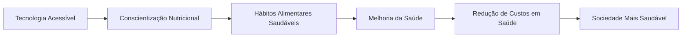

# Visão e Missão do BSFM

!!! success "Transformando Saúde Alimentar com Tecnologia"
    O **BSFM (Brazilian System of Food Metric)** é mais do que uma plataforma - é um movimento para democratizar o acesso à nutrição de qualidade no Brasil através da inteligência artificial.

## Nossa Visão

**Ser o sistema de referência em métricas alimentares no Brasil, democratizando o acesso à nutrição de qualidade através da tecnologia e transformando a saúde alimentar de milhões de brasileiros.**

> "Imaginamos um Brasil onde cada cidadão tenha acesso fácil e gratuito a análises nutricionais precisas, onde a tecnologia elimina barreiras e promove hábitos alimentares saudáveis desde a infância até a terceira idade."

## Nossa Missão

**Utilizar inteligência artificial de ponta para fornecer análises nutricionais precisas, acompanhamento personalizado e educação alimentar acessível a todos os brasileiros, independentemente de sua localização ou condição socioeconômica.**

### Pilares da Nossa Missão:

1. **Inovação Tecnológica**
   - Desenvolver soluções de IA que reconheçam e analisem alimentos com precisão
   - Criar interfaces intuitivas que qualquer pessoa possa usar
   - Integrar as mais avançadas pesquisas em nutrição e machine learning

2. **Contexto Brasileiro**
   - Adaptar tecnologias globais à realidade alimentar brasileira
   - Incluir alimentos regionais e tradições culinárias locais
   - Considerar fatores socioeconômicos no desenvolvimento de soluções

3. **Impacto na Saúde Pública**
   - Reduzir índices de obesidade, diabetes e doenças cardiovasculares
   - Apoiar políticas públicas de alimentação saudável
   - Integrar-se ao sistema público de saúde (SUS)

4. **Acesso Democrático**
   - Oferecer serviços gratuitos para a população em geral
   - Garantir acessibilidade para pessoas com deficiência
   - Disponibilizar APIs abertas para desenvolvedores e pesquisadores

## Valores Fundamentais

!!! note "Transparência Radical"
    **Acreditamos que dados nutricionais devem ser abertos e acessíveis.** Todas as nossas metodologias, algoritmos e fontes de dados são documentados publicamente.

!!! check "Precisão Científica"
    **Cada análise é baseada em evidências científicas.** Trabalhamos com nutricionistas, médicos e pesquisadores para garantir a qualidade dos dados.

!!! heart "Impacto Social Real"
    **Medimos nosso sucesso pelo impacto na saúde das pessoas.** Cada feature é desenvolvida pensando no benefício concreto para o usuário final.

!!! bulb "Inovação Contínua"
    **Estamos sempre evoluindo.** Acompanhamos as últimas pesquisas em IA, nutrição e saúde para oferecer sempre a melhor solução.

!!! people "Colaboração Aberta"
    **Acreditamos no poder da comunidade.** Convidamos desenvolvedores, pesquisadores e usuários a contribuir com o projeto.

## Nossa Teoria da Mudança



### Metas de Impacto 2026-2030

| Indicador | Meta 2026 | Meta 2028 | Meta 2030 |
|-----------|-----------|-----------|-----------|
| **Usuários Ativos** | 50.000 | 500.000 | 5.000.000 |
| **Análises Realizadas** | 1.000.000 | 10.000.000 | 100.000.000 |
| **Parcerias com SUS** | 10 municípios | 100 municípios | 1.000 municípios |
| **Redução de IMC** | 5% dos usuários | 15% dos usuários | 30% dos usuários |
| **Publicações Científicas** | 5 papers | 25 papers | 100 papers |

## Público-Alvo Prioritário

### 1. **População em Vulnerabilidade Social**
!!! warning "Prioridade Máxima"
    - Comunidades periféricas com acesso limitado a nutricionistas
    - Escolas públicas em áreas carentes
    - Unidades Básicas de Saúde (UBS) em todo o país

### 2. **Pacientes com Condições Crônicas**
!!! info "Acompanhamento Especializado"
    - Pessoas com diabetes, hipertensão e obesidade
    - Pacientes em tratamento oncológico
    - Idosos com necessidades nutricionais específicas

### 3. **Profissionais de Saúde**
!!! check "Ferramentas de Apoio"
    - Nutricionistas do SUS e rede privada
    - Médicos de família e comunidade
    - Agentes comunitários de saúde

### 4. **Educadores e Escolas**
!!! school "Educação desde Cedo"
    - Professores de ciências e biologia
    - Coordenadores pedagógicos
    - Merendeiras escolares

## Base Científica

### Parcerias Acadêmicas
- **Universidades Brasileiras:** USP, UNICAMP, UFMG, UFRJ
- **Institutos de Pesquisa:** Fiocruz, Instituto Butantan, Embrapa
- **Sociedades Científicas:** Sociedade Brasileira de Nutrição, Associação Brasileira de Nutrologia

### Fontes de Dados
```yaml
nutricionais:
  - USDA FoodData Central: 400.000+ alimentos
  - TACO: Tabela Brasileira de Composição de Alimentos
  - IBGE: Pesquisas de Orçamentos Familiares
  - ANVISA: Regulamentações e padrões

ia:
  - YOLO Custom Model: 452 alimentos reconhecidos
  - ONNX Runtime: Inferência otimizada
  - Transfer Learning: Adaptação contínua
```

## Contexto Brasileiro

### Desafios Específicos do Brasil
1. **Diversidade Alimentar Regional**
   - Adaptação para alimentos típicos de cada região
   - Consideração de hábitos culturais locais
   - Inclusão de alimentos tradicionais indígenas e quilombolas

2. **Desigualdade no Acesso**
   - Soluções que funcionem com internet limitada
   - Interfaces para baixa escolaridade
   - Preços acessíveis ou gratuitos

3. **Regulamentação Local**
   - Conformidade com ANVISA e Ministério da Saúde
   - Adaptação às leis de proteção de dados (LGPD)
   - Integração com sistemas governamentais

## Como Contribuir

### Para Cidadãos
1. **Use a plataforma** e forneça feedback honesto
2. **Compartilhe** com familiares e amigos
3. **Participe** de pesquisas e testes de usabilidade
4. **Denuncie** problemas de acesso ou usabilidade

### Para Profissionais de Saúde
1. **Sugira melhorias** baseadas em sua experiência clínica
2. **Contribua com dados** anonimizados de casos reais
3. **Participe** de grupos de discussão técnica
4. **Ajude a validar** a precisão das análises

### Para Desenvolvedores e Pesquisadores
1. **Contribua com código** no [GitHub](https://github.com/BSFM)
2. **Desenvolva integrações** com outras plataformas de saúde
3. **Conduza pesquisas** usando nossos dados anonimizados
4. **Proponha novas features** baseadas em evidências

### Para Empresas e Instituições
1. **Patrocine projetos** específicos de impacto social
2. **Forneça infraestrutura** para escalar a plataforma
3. **Integre** o BSFM em seus sistemas existentes
4. **Promova** a educação nutricional entre colaboradores

## Contato e Transparência

### Canais Oficiais
- **Email Institucional:** visao@bsfm.com.br
- **GitHub:** [BSFM/Brazilian-System-of-Food-Metric](https://github.com/BSFM)
- **Relatórios Anuais:** Disponível publicamente em nosso site
- **Auditorias:** Submetemos a auditorias independentes anuais

### Transparência Financeira
```yaml
recursos:
  - 70%: Desenvolvimento e manutenção da plataforma
  - 15%: Pesquisa e validação científica
  - 10%: Expansão e acesso em áreas carentes
  - 5%: Administração e compliance

fontes:
  - Doações de indivíduos e empresas
  - Grants de fundações e institutos
  - Parcerias com o setor público
  - Serviços premium para empresas
```

## Reconhecimentos e Certificações

### Certificações Obtidas
- **ANVISA:** Registro como software de saúde
- **LGPD:** Conformidade total com proteção de dados
- **Acessibilidade:** WCAG 2.1 AA para pessoas com deficiência
- **Segurança:** Certificação de segurança de dados de saúde

### Prêmios e Reconhecimentos
- **Prêmio Inovação em Saúde Pública** - Ministério da Saúde (2025)
- **Melhor Startup de Impacto Social** - Brazil Conference at Harvard (2025)
- **Top 100 Inovações para o SUS** - Conselho Nacional de Saúde (2024)

---

!!! quote "Nosso Compromisso"
    **"Acreditamos que tecnologia e saúde devem andar juntas. Nosso compromisso é usar a inovação para construir um Brasil mais saudável, começando pelo prato de cada brasileiro."**

*Equipe BSFM - Transformando bytes em saúde desde 2024*