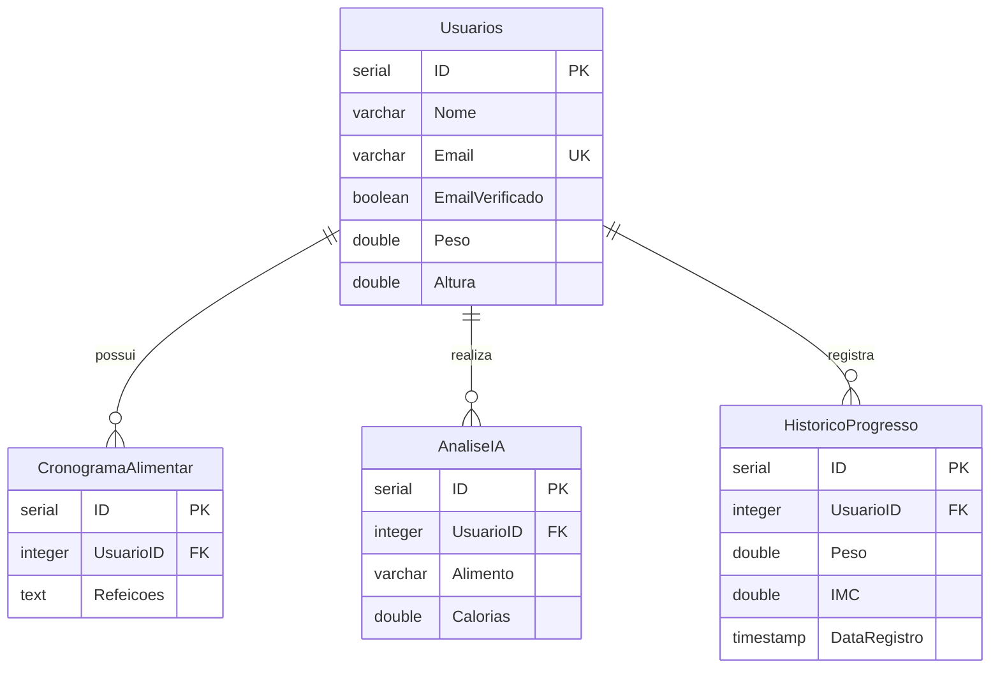

# Schema do Banco de Dados BSFM

## 📊 Visão Geral do Banco

O sistema BSFM utiliza PostgreSQL como banco de dados principal, com as seguintes características:
- **Database**: `bsfm_dev` (desenvolvimento) / `bsfm_prod` (produção)
- **Usuário**: `bsfm_user`
- **Encoding**: UTF-8
- **Collation**: pt_BR.UTF-8

## 🗃️ Tabelas do Sistema

### 1. Usuarios - Tabela Principal de Usuários
```sql
CREATE TABLE Usuarios (
    ID SERIAL PRIMARY KEY,
    Nome VARCHAR(255) NOT NULL DEFAULT '',
    Idade INTEGER NOT NULL,
    Email VARCHAR(255) NOT NULL DEFAULT '' UNIQUE,
    TokenVerificacao VARCHAR(255),
    EmailVerificado BOOLEAN NOT NULL DEFAULT FALSE,
    SenhaHash VARCHAR(255) NOT NULL DEFAULT '',
    AceitouTermos BOOLEAN NOT NULL DEFAULT FALSE,
    DataAceite TIMESTAMP NOT NULL DEFAULT CURRENT_TIMESTAMP,
    VersaoTermos VARCHAR(50) NOT NULL DEFAULT '',
    Sexo VARCHAR(20) NOT NULL DEFAULT 'Não Informado',
    Peso DOUBLE PRECISION NOT NULL,
    Altura DOUBLE PRECISION NOT NULL,
    TipoPessoa VARCHAR(50) NOT NULL DEFAULT 'Sedentário',
    Intolerancia TEXT NOT NULL DEFAULT '',
    IMC DOUBLE PRECISION NOT NULL DEFAULT 0,
    TMB DOUBLE PRECISION NOT NULL DEFAULT 0,
    GastoTotal DOUBLE PRECISION NOT NULL DEFAULT 0,
    PesoMeta DOUBLE PRECISION NOT NULL DEFAULT 0,
    CriadoEm TIMESTAMP NOT NULL DEFAULT CURRENT_TIMESTAMP,
    AtualizadoEm TIMESTAMP NOT NULL DEFAULT CURRENT_TIMESTAMP
);

CREATE INDEX idx_usuarios_email ON Usuarios(Email);
CREATE INDEX idx_usuarios_email_verificado ON Usuarios(EmailVerificado);
```

### 2. Refeicoes - Catálogo de Refeições
```sql
CREATE TABLE Refeicoes (
    ID SERIAL PRIMARY KEY,
    NomeRefeicao VARCHAR(255) NOT NULL DEFAULT '',
    Categoria VARCHAR(100) NOT NULL DEFAULT '',
    Ingredientes TEXT NOT NULL DEFAULT '',
    Calorias DOUBLE PRECISION NOT NULL DEFAULT 0,
    Proteinas DOUBLE PRECISION NOT NULL DEFAULT 0,
    Carboidratos DOUBLE PRECISION NOT NULL DEFAULT 0,
    Gorduras DOUBLE PRECISION NOT NULL DEFAULT 0,
    CriadoEm TIMESTAMP NOT NULL DEFAULT CURRENT_TIMESTAMP
);

CREATE INDEX idx_refeicoes_categoria ON Refeicoes(Categoria);
CREATE INDEX idx_refeicoes_calorias ON Refeicoes(Calorias);
```

### 3. Comidas - Alimentos Individuais
```sql
CREATE TABLE Comidas (
    ID SERIAL PRIMARY KEY,
    NomeComida VARCHAR(255) NOT NULL DEFAULT '',
    Categoria VARCHAR(100) NOT NULL DEFAULT '',
    Calorias DOUBLE PRECISION NOT NULL DEFAULT 0,
    Proteinas DOUBLE PRECISION NOT NULL DEFAULT 0,
    Carboidratos DOUBLE PRECISION NOT NULL DEFAULT 0,
    Gorduras DOUBLE PRECISION NOT NULL DEFAULT 0,
    CriadoEm TIMESTAMP NOT NULL DEFAULT CURRENT_TIMESTAMP
);

CREATE INDEX idx_comidas_nome ON Comidas(NomeComida);
CREATE INDEX idx_comidas_categoria ON Comidas(Categoria);
```

### 4. CronogramaAlimentar - Planos Alimentares
```sql
CREATE TABLE CronogramaAlimentar (
    ID SERIAL PRIMARY KEY,
    UsuarioID INTEGER NOT NULL,
    Refeicoes TEXT NOT NULL DEFAULT '',
    Planos TEXT NOT NULL DEFAULT '',
    CriadoEm TIMESTAMP NOT NULL DEFAULT CURRENT_TIMESTAMP,
    AtualizadoEm TIMESTAMP NOT NULL DEFAULT CURRENT_TIMESTAMP,
    
    CONSTRAINT fk_cronograma_usuario 
        FOREIGN KEY (UsuarioID) 
        REFERENCES Usuarios(ID) 
        ON DELETE CASCADE
);

CREATE INDEX idx_cronograma_usuario ON CronogramaAlimentar(UsuarioID);
```

### 5. Hospitais - Instituições de Saúde
```sql
CREATE TABLE Hospitais (
    ID SERIAL PRIMARY KEY,
    NomeHospital VARCHAR(255) NOT NULL DEFAULT '',
    Endereco TEXT NOT NULL DEFAULT '',
    Telefone VARCHAR(50) NOT NULL DEFAULT '',
    CriadoEm TIMESTAMP NOT NULL DEFAULT CURRENT_TIMESTAMP
);

CREATE INDEX idx_hospitais_nome ON Hospitais(NomeHospital);
```

### 6. AnaliseIA - Análises de Alimentos por IA
```sql
CREATE TABLE AnaliseIA (
    ID SERIAL PRIMARY KEY,
    UsuarioID INTEGER NOT NULL,
    Alimento VARCHAR(255) NOT NULL DEFAULT '',
    Calorias DOUBLE PRECISION NOT NULL DEFAULT 0,
    Proteinas DOUBLE PRECISION NOT NULL DEFAULT 0,
    Carbos DOUBLE PRECISION NOT NULL DEFAULT 0,
    Gorduras DOUBLE PRECISION NOT NULL DEFAULT 0,
    Porcao VARCHAR(100) NOT NULL DEFAULT '',
    DataAnalise TIMESTAMP NOT NULL DEFAULT CURRENT_TIMESTAMP,
    
    CONSTRAINT fk_analiseia_usuario 
        FOREIGN KEY (UsuarioID) 
        REFERENCES Usuarios(ID) 
        ON DELETE CASCADE
);

CREATE INDEX idx_analiseia_usuario ON AnaliseIA(UsuarioID);
CREATE INDEX idx_analiseia_data ON AnaliseIA(DataAnalise);
```

### 7. HistoricoProgresso - Evolução dos Usuários
```sql
CREATE TABLE HistoricoProgresso (
    ID SERIAL PRIMARY KEY,
    UsuarioID INTEGER NOT NULL,
    Peso DOUBLE PRECISION NOT NULL,
    Altura DOUBLE PRECISION NOT NULL,
    IMC DOUBLE PRECISION NOT NULL,
    DataRegistro TIMESTAMP NOT NULL DEFAULT CURRENT_TIMESTAMP,
    
    CONSTRAINT fk_historicoprogresso_usuario 
        FOREIGN KEY (UsuarioID) 
        REFERENCES Usuarios(ID) 
        ON DELETE CASCADE
);

CREATE INDEX idx_historicoprogresso_usuario ON HistoricoProgresso(UsuarioID);
CREATE INDEX idx_historicoprogresso_data ON HistoricoProgresso(DataRegistro);
```

## 🔗 Relacionamentos entre Tabelas



## 📋 Script de Criação Completo

```sql
-- Script completo de criação do banco BSFM
CREATE DATABASE bsfm_dev 
    WITH 
    OWNER = postgres
    ENCODING = 'UTF8'
    LC_COLLATE = 'pt_BR.UTF-8'
    LC_CTYPE = 'pt_BR.UTF-8'
    CONNECTION LIMIT = -1;

\c bsfm_dev

-- Criar usuário específico para a aplicação
CREATE USER bsfm_user WITH PASSWORD 'senha_segura_alterar_em_producao';
GRANT ALL PRIVILEGES ON DATABASE bsfm_dev TO bsfm_user;

-- Conceder permissões nas tabelas
GRANT ALL PRIVILEGES ON ALL TABLES IN SCHEMA public TO bsfm_user;
GRANT ALL PRIVILEGES ON ALL SEQUENCES IN SCHEMA public TO bsfm_user;

-- Executar os CREATE TABLE acima nesta ordem
-- 1. Usuarios
-- 2. Refeicoes  
-- 3. Comidas
-- 4. Hospitais
-- 5. CronogramaAlimentar (depende de Usuarios)
-- 6. AnaliseIA (depende de Usuarios)
-- 7. HistoricoProgresso (depende de Usuarios)
```

## 🚀 Considerações de Performance

- Todas as tabelas possuem índices nas chaves estrangeiras e campos de busca frequente
- Campos de data/hora são indexados para consultas temporais
- Textos longos usam tipo TEXT com indexação apropriada
- Chaves únicas garantem integridade dos dados (ex: email único)

## 🔧 Manutenção do Banco

```sql
-- Backup completo
pg_dump -U postgres -d bsfm_dev -F c -f backup_bsfm.dump

-- Restaurar backup
pg_restore -U postgres -d bsfm_dev backup_bsfm.dump

-- Monitorar performance
SELECT * FROM pg_stat_user_tables WHERE schemaname = 'public';

-- Estatísticas de uso
SELECT 
    relname AS table_name,
    n_live_tup AS live_rows,
    n_dead_tup AS dead_rows,
    last_autovacuum,
    last_autoanalyze
FROM pg_stat_user_tables;
```