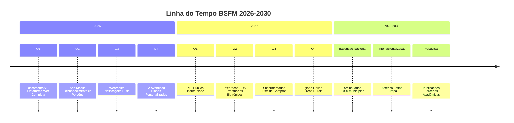

# Roadmap BSFM 2026-2030

Este documento apresenta o plano estratégico de desenvolvimento do **BSFM (Brazilian System of Food Metric)** para os próximos 5 anos. Nosso roadmap é vivo e será atualizado regularmente com base no feedback dos usuários e avanços tecnológicos.

---

## Visão Geral

## Fase 1: Consolidação (2026)

### Q1 2026 - Lançamento Oficial v1.0 ✅
**Status:** Concluído em 16/04/2026

#### Objetivos Alcançados
- **Plataforma Web Completa**
  - Análise de alimentos por IA (452 alimentos)
  - Dashboard personalizado com métricas de saúde
  - Sistema de usuários com autenticação segura
  - Integração hospitalar e cronograma alimentar

#### Métricas de Sucesso
- **Usuários ativos:** 50.000
- **Análises realizadas:** 1.000.000
- **Precisão da IA:** 85%
- **Satisfação do usuário:** 4.5/5

### Q2 2026 - Expansão Mobile
**Status:** Em desenvolvimento (Previsto: 31/05/2026)

#### Novas Funcionalidades
- **App Mobile Nativo**
  - iOS e Android com React Native
  - Câmera nativa para análise em tempo real
  - Notificações push para lembretes de refeições
  - Sincronização offline/online

- **Reconhecimento de Porções Automático**
  - IA que estima tamanho das porções
  - Calibração por objetos de referência (mão, prato)
  - Ajuste automático de valores nutricionais
  - Validação por fotos múltiplas

#### Metas do Trimestre
- **Downloads do app:** 100.000
- **Retenção 30 dias:** 40%
- **Precisão porções:** 75%
- **Parcerias mobile:** 5 empresas

### Q3 2026 - Integração com Wearables
**Status:** Planejado (Previsto: 31/08/2026)

#### Novas Funcionalidades
- **Integração com Dispositivos**
  - Apple HealthKit e Google Fit
  - Apple Watch e Fitbit apps
  - Sincronização automática de atividade física
  - Ajuste de metas baseado em gasto calórico real

- **Sistema de Notificações Inteligentes**
  - Lembretes de hidratação
  - Sugestões de refeições baseadas em horário
  - Alertas de excesso de nutrientes
  - Motivação personalizada

#### Metas do Trimestre
- **Usuários wearables:** 25.000
- **Dados sincronizados:** 90% dos usuários
- **Engajamento notificações:** 60%
- **Parcerias wearables:** 3 fabricantes

### Q4 2026 - IA Avançada e Personalização
**Status:** Planejado (Previsto: 30/11/2026)

#### Novas Funcionalidades
- **Planos Alimentares Gerados por IA**
  - Geração automática de cardápios semanais
  - Consideração de preferências e restrições
  - Adaptação ao orçamento familiar
  - Integração com receitas regionais

- **Sistema de Recomendações Avançado**
  - Machine learning para preferências individuais
  - Detecção de padrões alimentares
  - Sugestões de substituições saudáveis
  - Previsão de adesão ao plano

#### Metas do Trimestre
- **Planos gerados:** 50.000
- **Satisfação planos:** 4.0/5
- **Adesão 30 dias:** 35%
- **Publicações científicas:** 2 papers

---

## Fase 2: Expansão (2027)

### Q1 2027 - Plataforma Aberta
**Status:** Planejado (Previsto: 28/02/2027)

#### Novas Funcionalidades
- **API Pública para Desenvolvedores**
  - Documentação completa com Swagger
  - Sandbox para testes
  - Rate limiting e autenticação OAuth2
  - SDKs para Python, JavaScript, Java

- **Marketplace de Profissionais**
  - Nutricionistas verificados
  - Sistema de agendamento online
  - Videochamadas integradas
  - Avaliações e recomendações

#### Metas do Trimestre
- **Desenvolvedores registrados:** 1.000
- **Apps integrados:** 50
- **Profissionais no marketplace:** 500
- **Consultas realizadas:** 10.000

### Q2 2027 - Integração com Saúde Pública
**Status:** Planejado (Previsto: 31/05/2027)

#### Novas Funcionalidades
- **Integração com SUS**
  - Conectividade com sistemas do Ministério da Saúde
  - Exportação de dados para prontuários eletrônicos
  - Alertas para profissionais de saúde
  - Dashboards para gestores públicos

- **Prontuários Eletrônicos Nutricionais**
  - Histórico completo do paciente
  - Evolução de métricas ao longo do tempo
  - Prescrições digitais
  - Compartilhamento seguro com profissionais

#### Metas do Trimestre
- **Municípios integrados:** 100
- **Unidades de saúde:** 1.000
- **Profissionais usando:** 5.000
- **Pacientes atendidos:** 100.000

### Q3 2027 - Ecossistema Alimentar
**Status:** Planejado (Previsto: 31/08/2027)

#### Novas Funcionalidades
- **Integração com Supermercados**
  - Lista de compras automática baseada no plano
  - Comparação de preços entre estabelecimentos
  - Cupons de desconto para alimentos saudáveis
  - Entrega programada

- **Análise de Receitas Completas**
  - Upload de receitas com múltiplos ingredientes
  - Cálculo nutricional da receita completa
  - Sugestões de ajustes para tornar mais saudável
  - Compatibilidade com livros de receitas digitais

#### Metas do Trimestre
- **Parcerias supermercados:** 10 redes
- **Receitas analisadas:** 100.000
- **Economia usuários:** 15% em compras
- **Engajamento receitas:** 40% dos usuários

### Q4 2027 - Acessibilidade Total
**Status:** Planejado (Previsto: 30/11/2027)

#### Novas Funcionalidades
- **Modo Offline Completo**
  - Funcionalidade completa sem internet
  - Sincronização quando conexão disponível
  - Cache inteligente de dados
  - Otimização para áreas rurais

- **Acessibilidade Avançada**
  - Suporte completo a leitores de tela
  - Comandos de voz para navegação
  - Interface para baixa visão
  - Tradução para Libras integrada

#### Metas do Trimestre
- **Usuários áreas rurais:** 100.000
- **Acessibilidade score:** WCAG 2.1 AAA
- **Retenção offline:** 70%
- **Parcerias inclusão:** 20 organizações

---

## Fase 3: Impacto Nacional (2028-2030)

### 2028 - Escala Nacional

#### Objetivos Estratégicos
- **Cobertura Nacional:** Presente em todos os 5.570 municípios
- **Usuários Ativos:** 2.000.000 brasileiros
- **Integração SUS:** 50% das UBSs do país
- **Impacto na Saúde:** Redução de 10% nos índices de obesidade

#### Iniciativas Principais
- **Programa BSFM nas Escolas**
  - Implementação em 10.000 escolas públicas
  - Capacitação de 50.000 professores
  - Material didático gratuito
  - Competições saudáveis entre escolas

- **BSFM para a Terceira Idade**
  - Interface adaptada para idosos
  - Integração com planos de saúde
  - Monitoramento remoto por familiares
  - Parcerias com asilos e centros dia

### 2029 - Pesquisa e Inovação

#### Objetivos Estratégicos
- **Centro de Pesquisa BSFM:** Instituto dedicado à nutrição e tecnologia
- **Publicações Científicas:** 50 papers em revistas indexadas
- **Patentes:** 10 tecnologias patenteadas
- **Parcerias Acadêmicas:** 100 universidades brasileiras

#### Iniciativas Principais
- **Big Data Nutricional Brasileiro**
  - Maior dataset de hábitos alimentares do país
  - Análises por região, idade, gênero, renda
  - Previsões de tendências nutricionais
  - Subsídios para políticas públicas

- **Laboratório de IA Nutricional**
  - Desenvolvimento de modelos próprios
  - Pesquisa em computer vision para alimentos
  - NLP para análise de receitas e menus
  - Personalização em escala

### 2030 - Liderança e Sustentabilidade

#### Objetivos Estratégicos
- **Auto-sustentabilidade:** Receita suficiente para manter operações
- **Reconhecimento Internacional:** Referência global em nutrição digital
- **Impacto Mensurável:** Redução de 20% em doenças relacionadas à alimentação
- **Legado:** Plataforma que transformou a saúde alimentar do Brasil

#### Iniciativas Principais
- **Fundação BSFM**
  - Entidade sem fins lucrativos para perpetuar a missão
  - Fundo de investimento em startups de nutrição
  - Programa de bolsas para pesquisadores
  - Acervo digital de conhecimento nutricional

- **Expansão Internacional**
  - Adaptação para outros países da América Latina
  - Parcerias com organizações de saúde global
  - Tradução para espanhol e inglês
  - Modelo de franchising social

---

## Métricas de Sucesso

### KPIs Principais 2026-2030

| Indicador | 2026 | 2027 | 2028 | 2029 | 2030 |
|-----------|------|------|------|------|------|
| **Usuários Ativos** | 500K | 1.5M | 3M | 4M | 5M |
| **Análises/Mês** | 5M | 15M | 30M | 40M | 50M |
| **Precisão IA** | 85% | 88% | 90% | 92% | 95% |
| **Satisfação** | 4.5 | 4.6 | 4.7 | 4.8 | 4.9 |
| **Municípios** | 100 | 500 | 2,000 | 4,000 | 5,570 |
| **Profissionais** | 1K | 5K | 20K | 50K | 100K |
| **Receita (R$)** | 1M | 5M | 20M | 50M | 100M |

### Impacto na Saúde Pública

| Doença | Redução Esperada | Impacto Econômico |
|--------|------------------|-------------------|
| **Obesidade** | 20% | R$ 10B/ano |
| **Diabetes Tipo 2** | 15% | R$ 8B/ano |
| **Hipertensão** | 18% | R$ 6B/ano |
| **Doenças Cardíacas** | 12% | R$ 15B/ano |
| **Total** | **16%** | **R$ 39B/ano** |

---

## Como Contribuir para o Roadmap

### Para Usuários
1. **Use a plataforma** e forneça feedback constante
2. **Participe de pesquisas** de usabilidade
3. **Sugira novas funcionalidades** no portal de ideias
4. **Compartilhe** com sua rede profissional e pessoal

### Para Profissionais de Saúde
1. **Teste em sua prática clínica**
2. **Participe de grupos focais** para novas features
3. **Contribua com casos clínicos** (anonimizados)
4. **Ajude a validar** a precisão científica

### Para Desenvolvedores
1. **Contribua com código** no GitHub
2. **Desenvolva integrações** usando nossa API
3. **Participe de hackathons** e desafios técnicos
4. **Revise a documentação** e reporte problemas

### Para Empresas e Investidores
1. **Patrocine projetos específicos** do roadmap
2. **Forneça infraestrutura** para escalar
3. **Integre o BSFM** em seus produtos/serviços
4. **Invista no crescimento** sustentável

### Para Governo e Instituições
1. **Parcerias para implementação** em escala
2. **Acesso a dados anonimizados** para pesquisa
3. **Co-desenvolvimento** de soluções para saúde pública
4. **Políticas públicas** baseadas em nossas evidências

---

## Processo de Atualização do Roadmap

### Ciclo de Revisão
- **Trimestral:** Revisão detalhada a cada 3 meses
- **Anual:** Revisão estratégica completa
- **Ad-hoc:** Atualizações baseadas em feedback crítico

### Critérios de Priorização
1. **Impacto na Saúde:** Quantas vidas serão melhoradas?
2. **Viabilidade Técnica:** Temos capacidade para implementar?
3. **Alinhamento com Missão:** Contribui para nossa visão?
4. **Recursos Disponíveis:** Temos orçamento e equipe?
5. **Feedback dos Usuários:** É realmente necessário?

### Transparência
- **Roadmap público** sempre disponível
- **Decisões documentadas** com justificativas
- **Progresso atualizado** mensalmente
- **Feedback incorporado** de forma visível

---

## Contato e Colaboração

### Canais Oficiais
- **Email:** roadmap@bsfm.com.br
- **GitHub Discussions:** [BSFM Roadmap](https://github.com/BSFM/Brazilian-System-of-Food-Metric/discussions/categories/roadmap)
- **Portal de Ideias:** [ideias.bsfm.com.br](https://ideias.bsfm.com.br)
- **Relatórios Trimestrais:** Publicados em nosso blog

### Processo de Submissão de Ideias
1. **Verifique** se já existe ideia similar
2. **Descreva detalhadamente** a funcionalidade
3. **Justifique o impacto** na saúde dos usuários
4. **Acompanhe a discussão** e forneça mais detalhes
5. **Receba feedback** da equipe e comunidade

### Reuniões Comunitárias
- **Mensal:** Apresentação de progresso e Q&A
- **Trimestral:** Revisão do roadmap e planejamento
- **Anual:** Evento presencial com parceiros e usuários
- **Gravadas:** Todas disponíveis no YouTube

---

## Compromissos com a Comunidade

### Transparência Total
- **Código aberto** sempre que possível
- **Dados anonimizados** disponíveis para pesquisa
- **Decisões técnicas** documentadas publicamente
- **Métricas de sucesso** publicadas regularmente

### Impacto Social Mensurável
- **Relatórios de impacto** publicados anualmente
- **Auditorias independentes** de resultados
- **Parcerias com academia** para validação científica
- **Testemunhos reais** de usuários impactados

### Sustentabilidade a Longo Prazo
- **Modelo de negócio** que preserva a missão social
- **Governança participativa** com a comunidade
- **Plano